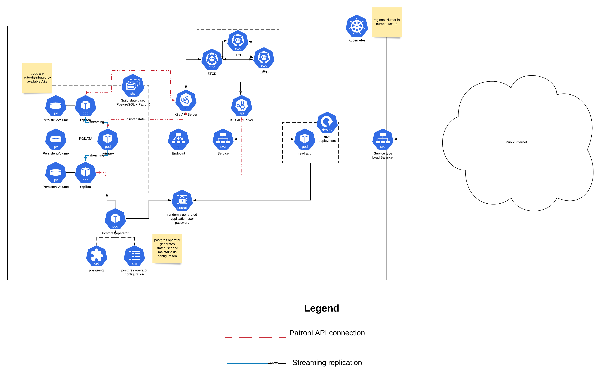
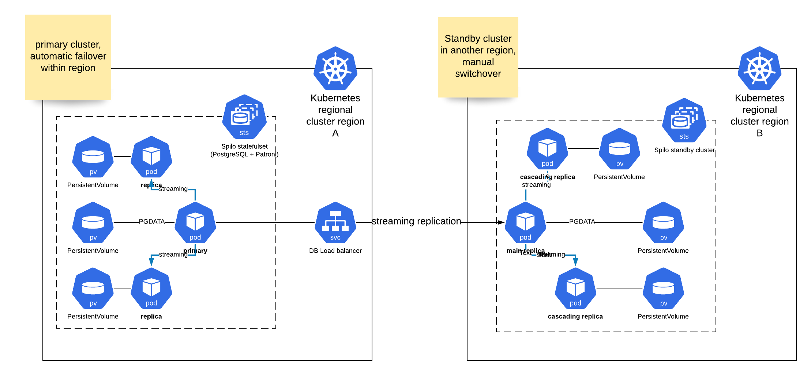

# rev4

## Notes and assumptions

* date format for birthday is YYYY-MM-DD (ISO 8601) and the database is
  configured with the same datestyle (should be default).

* Leap year birthdays are celebrated on March 1st in non-leap years (depends on
  the person's country of residence/ origin, most countries follow this rule,
  but not all, i.e. Taiwan recognizes Feb. 28th birthday date)

* BC dates are not supported.

* Since there is no authentication, people with the same name are considered
  identical. A second request to set the birthday for the identical person
  changes the original birthday in the DB. Note that holding a birthday date
  immutable wouldn't solve the problem, without authentication it is possible to
  get a wrong birthday date for the person with the name identical to the one
  already existing in the DB. The decision is primarily made because of the
  simplicity of the implementation (insert/on conflict update in the DB)

* application/json and application/x-www-form-urlencoded input is accepted, the
  output is emitted with either application/json or text/plain depending on the
  'Accept' header sent by the client.

* The stated API format with name in the path for PUT and in the query for GET
  is cumbersome. There seems to be no reason to prefer GET /hello/:name over GET
  /hello?name=:name, other than for the purposes of making the task a bit more
  complex.

* We could save some space by storing the date as 2 bytes (discarding the year,
  or setting the more restrictive lower and upper boundary on the acceptable
  years). In practice, though, the extra space will be likely eaten by 8-byte
  alignment requirement for the next row.

* The app uses a connection pool of 20 connections. One can scale the number of
  apps with an LB to serve more, that would require a pgbouncer in front of the
  PostgreSQL database in a transactional mode and slight tweaks to jackc/pgx to
  avoid relying on automatically prepared statements.

* The model layer relies on DB functions, as it's easier to work with dates in
  the DB. There is a script to test them at sql/test.sh (requires PGDATABASE
  environment variable to point to the running local DB, will truncate
  hello.birthday table).

* The tests for the controller are accessible with go test ./...

* PostgreSQL 9.5 is required (because of the INSERT/ON CONFLICT UPDATE).

* The app uses standard libpq environment variables (PGDATABASE, PGHOST, PGPORT
  etc) to configure a postgres connection.

## Deployment

The app should be deployed to a Kubernetes cluster. In that sense, the deployment
process is the same no matter whether it is deployed to staging, production
or local testing cluster.

I've used google free tier (they give $300 free credits for testing), creating
the cluster with the following commands (eu-west-3 is Germany/Frankfurt):
```
cloud config set compute/region eu-west-3
gcloud container clusters create --region europe-west3 test-cluster --num-nodes=2
```

Note that free tier is limited by 8 IP addresses, so we have to limit the number
of nodes. The limit doesn't exist or liftable on the paid tier.

Once the cluster is there, we'll use `kubectl -k` (or kustomize) to deploy our DB
in the APP. The Postgres databases will be managed by the postgres operator
(github.com/zalando/postgres-operator), that will create an HA cluster of 3
nodes from the CRD (located in manifests/pg/rev4-pg.yaml) and will maintain the
defined cluster configuration. The replicas are streaming, minimizing the lag
and the auto-failover is provided by Patroni
(https://github.com/zalando/Patroni), that uses K8S API backed by Etcd in order
to provide consistent view of the cluster.

```
# deploy the operator and the database

kubectl apply -k manifests/pg/

# wait until PostgreSQL is up and running, use
# kubectl get pods -l spilo-role=master,version=rev4-pg -L spilo-role,version
# to detect the master pod start. Typically it takes around 1m to start PG

# deploy the application and populate DB schema

kubectl apply -k manifests/app/

#Once the application is app and running (typically another minute or so),
#one cal look at the LB IP address:

kubectl get svc rev4-service -o jsonpath="{.status.loadBalancer.ingress[0].ip}"

# use the address obtained to connect to the app, i.e.
#
# http PUT 1.1.1.1:8080/hello/bill dateOfBirth='1999-05-07'
# HTTP/1.1 201 Created
# Content-Length: 0
#Date: Fri, 18 Oct 2019 10:03:47 GMT

#http -j 1.1.1.1:8080/hello?name=bill
#HTTP/1.1 200 OK
#Content-Length: 56
#Content-Type: application/json
#Date: Fri, 18 Oct 2019 10:04:08 GMT
#
#{
#    "Message": "Hello, bill! Your birthday is in 201 days"
#}

It is possible to configure the postgres and the app to work together with
AWS route53 or Cloud DNS.

```

If `kubectl -k` is not available (requires kubectl 1.14 or higher), look at
`kustomize.yaml` in `manifests/app` and `manifests/pg` and run `kubectl create -f`
on the invidual manifests in the way specified in kustomize.yaml


The deployment can be described with the [following diagram](res/k8s.pdf "rev4 app with HA PostgreSQL on K8s")



Note that it doesn't show the intial DB deployment via the K8s job, as I hit the
limit on the number of objects on lucidchart diagram free layer.

In production environment one would preferrably use CI/CD or github hooks instead
of deploying the setup manually.

## APP High-Availability

For simplicity, the app deployment is set to 3 instances by default.
It's trivial to bump it up to a higher number, or reduce it to 1 for testing,
just change the number of replicas in the manifests/app/deployment.yaml and do
```kubectl apply -f manifests/app/deployment.yaml```

The manifest configures the `readinessProbe` and the `rollingUpdate` strategy.
When updating the app, Kubernetes will make sure the pods are not terminated all
at once and there are active app instances serving requests during update.

## DB High-Availability.

Postgres-operator spawns Postgres cluster with 3 pods in a statefulset, byt
default spread over available zones. If the primary dies, Patroni on standbys
will initiate the leader race and promote the new primary, while the previous
one will be respawned as a replica by the statefulset.

Usage in production: there is no WAL shipping in this setup, as it requires
access to an S3 bucket. When used in production, one should setup WAL bucket
for the Postgres pods in order to support recovering when all running pods are
down, pg_rewind and running a standby cluster.

Right now, the DB is set with the service type set to the Load balancer, to accomodate
a potential standby cluster in another region. In production, the range of
addresses that are allowed to connect should be limited to the absolute minimum
by changing the ``allowedSourceRanges`` of the LB.

### DB-cross-region availability.

It's possible to setup a standby cluster, however, due to reliance on the S3
bucket this is not implemented (see
https://postgres-operator.readthedocs.io/en/latest/user/#setting-up-a-standby-cluster)

The possible setup can be illustrated by the [following diagram](res/multi-region.pdf)


It's possible to configure streaming replication for the standby cluster, but it
involves customizing postgres pod manually, since postgres-operator doesn't
support that in the moment. It relies on the Patroni standby cluster feature
(https://patroni.readthedocs.io/en/latest/replica_bootstrap.html#standby-cluster).

DB cross-region automatic failover is not implemented in either of those
options. In practice, the failure of the whole region is a major event and
typically requires manual coordination anyway. It's enough to have the copy of
the data outside of the region (with a standby cluster or an S3 bucket) and have
procedures to switchover/failover manually. The reliable cross-region failover
could be implemented between regions that are not too far away latency-wise (i.e
Germany/Belgium), but would require running in at least 3 such regions and
therefore, typically impractical.


